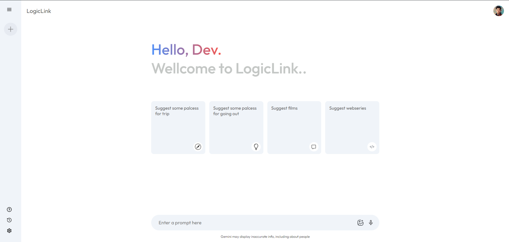

<h3 align="center">Modern AI Chat-Bot LogicLink</h3>

**LogicLink AI** is an intelligent conversational AI chatbot built using React, Gemini API, and local storage. The project is a clone of the Gemini AI chatbot, offering real-time conversations with users, storing chat history locally, and featuring a clean, responsive UI for easy interaction.

## 🔋 Features

👉 **Conversational AI**: Powered by the Gemini API for smart, contextual replies. <br>
👉 **Local Storage**: Saves chat history locally so users can pick up conversations where they left off.<br>
👉 **Responsive Design**: A fully responsive UI built with CSS and React.<br>
👉 **User-friendly Interface**: Simple and intuitive chatbot interface.<br>
👉 **Real-time Interaction**: Fetches API responses and displays them in real-time.<br>
👉 **Error Handling**: Gracefully handles API and network errors, ensuring a smooth user experience.<br>
👉 **Customizable**: Easily adaptable for other AI backends or additional features.<br>


## 📋 Table of Contents

- 😇 [Tech Stack](#tech-stack)
- 💾 [Installation](#installation)
- 🫸 [Usage](#usage)
- 📈 [Features Overview](#features-overview)
- 🌎 [API Integration](#api-integration)
- 💈 [Styling](#styling)
- 📍 [Local Storage](#local-storage)
- 🥈 [Contributing](#contributing)
- 🪪 [License](#license)


## ⚙️ Tech Stack

- **React.js**: JavaScript framework for building the user interface.
- **Gemini API**: For AI chatbot responses and conversation handling.
- **CSS**: Custom styling for the chatbot UI.
- **Local Storage**: To store chat history between user sessions.

## 🕸️ Installation

### Prerequisites
Ensure you have GIT, Node.js and npm installed on your machine.
- [Git](https://git-scm.com/)
- [Node.js](https://nodejs.org/en)
- [npm](https://www.npmjs.com/) (Node Package Manager)


1. Clone the repository:

   ```bash
   git clone https://github.com/yourusername/logiclink-ai.git
   cd logiclink-ai
   ```

2. Install the required dependencies:
   ```bash
   npm install
   ```
3. Obtain an API key from the [Gimini](https://ai.google.dev/gemini-api?_gl=1*1f81ou5*_up*MQ..&gclid=Cj0KCQjwi5q3BhCiARIsAJCfuZkyAv28ZGIr7Th2ryf4VPxm85hUVGWkOhfctMIn683rwnF_o68_jFwaAp_wEALw_wcB)

4. Create a code <code>.env</code> file in the root directory of the project and add your API key.
   ```bash
   npm start
   ```
5. The application will be available at <code>http://localhost:5173</code>.

## Features Overview

**Conversational AI** :
LogicLink AI provides real-time responses using the Gemini API. Users can ask questions or engage in a conversation, and the AI will provide intelligent, context-aware replies.

**Local Storage** :
Chat history is automatically stored in the browser’s local storage, allowing users to revisit and continue their previous conversations.

**Responsive Design** :
LogicLink AI uses a responsive design to provide a seamless experience on any device, from desktops to mobile phones.